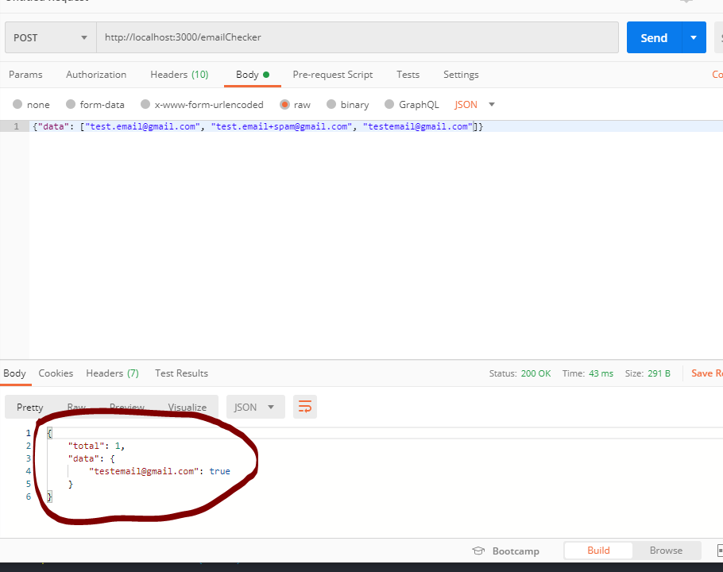

# fetchrewards-emailchecker
###
Mustafa Bereket
For questions please feel free to email mustafa.bereket@outlook.com

#Problem Description
Please write a web service that accepts http requests and returns responses based on the following problem statement. You may define the request and response format as you see fit based on the problem statement.
Problem statement: Accept a list of email addresses and return an integer indicating the number of unique email addresses. Where "unique" email addresses means they will be delivered to the same account using Gmail account matching. Specifically: Gmail will ignore the placement of "." in the username. And it will ignore any portion of the username after a "+".
Examples:
test.email@gmail.com, test.email+spam@gmail.com and testemail@gmail.com will all go to the same address, and thus the result should be 1.
For any requirements not specified via an example, use your best judgement to determine expected result.

## Installation
After cloning the repo,
- ```cd fetchrewards-emailchecker``` (go to root folder)
- ```npm install``` (install dependencies)
- ```npm start``` (start the server)

After that, you can use PostMan or any other tool make a POST request to
```http://localhost:3000/emailChecker```
POST request body should be an object with data attribute:
``` {data: [Your_List_of_Email_Addresses]} ```

## Notes
- Main logic in this app comes from validateEmail function and the Regex definition. 
Regex definition:
This is almost the same as any other regex for email validation you can find online. 
EXCEPT, I added '+' (plus sign) to accept that as valid email.
ValidateEmail Function: 
params: 
email[String] (emailAddress)
db[Object] (HashMap to store unique values for each request)

Definition:
- In this function I am basically checking if the given Email address passes my regex test (making sure it is a valid email)
- Also double checking to see if the given email address is already in the list, if so, then skip
- After passing first if check, I am dividing email address into 2 chunks localPart and domainPart and checking following
    - Plus sign check:
        This part is to get rid of whatever comes after plus sign
    - Lowercase Control
        Making sure everything is being recorded as lowercase to avoid creating extra key value pairs due to different capitalization
    - Dot check
        Saving email adress without the dot character in the 'localPart'


## DEMO (Sample image)
 